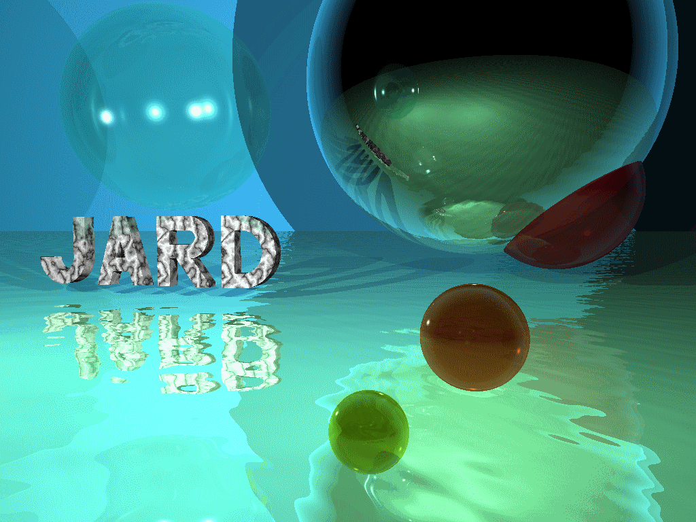

<!-- # Welcome to GitHub Desktop!

This is your README. READMEs are where you can communicate what your project is and how to use it.

Write your name on line 6, save it, and then head back to GitHub Desktop. -->

<h1>Este es uno de mis primeros proyecto en github</h1>

José Antonio Rojas Delgado

Visita mi web en [http://www.rojasdelgado.com](http://www.rojasdelgado.com)

<!-- Descarga [mi logo](http://www.rojasdelgado.com/fondoagua.gif) -->

<!--  -->

